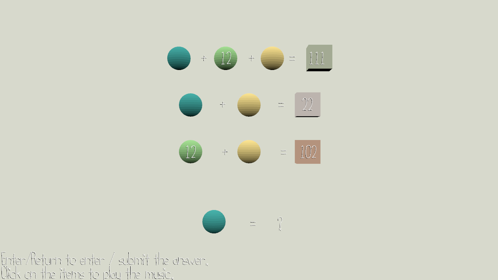

# Music Is Math

This is an assignment project for CMU 15466/15666 course.

#### Author: Jialan Dong

#### Design:

Spheres are music tracks, and cubes are music made up with these sphere tracks. Each sphere/cube represents a non-negative integer in base-?. Your goal is to solve the music-math puzzle and figure out the question.

#### Screen Shot:

#### How To Play:

`Enter/Return` can let you enter/submit your answer;

`Mouse Cliks on a sphere/cube` can play the corresponding music the sphere/cube represents;

`Escape` can stop all sounds.

Use your brain to do the math part.

 

This game was built with [NEST](NEST.md).
